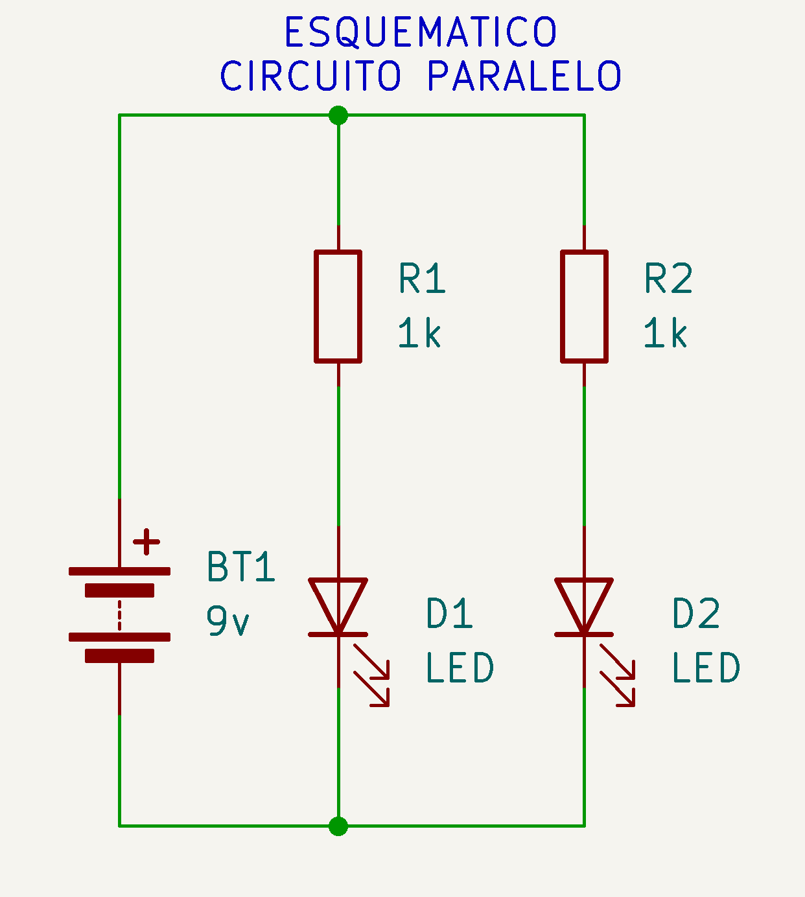
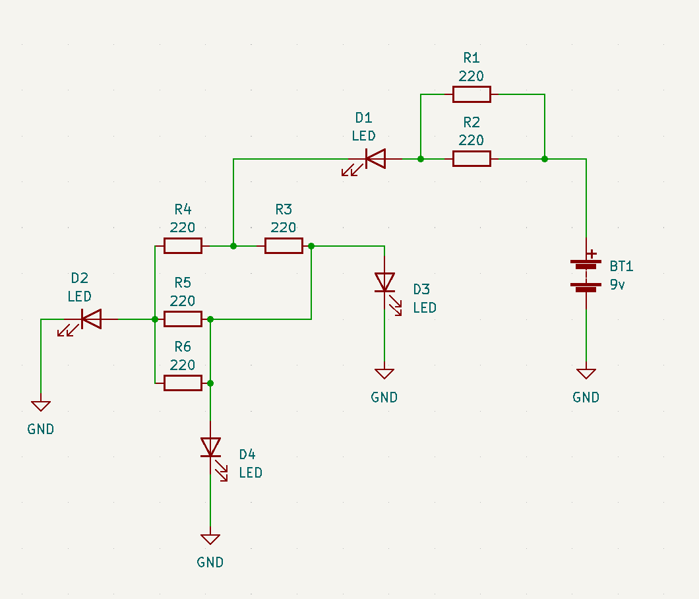

# sesion-02a

## Circuito básico

## Circuito paralelo

## Encargo: LQXTLC

Armar estos esquemáticos en su protoboard. Documentar que pasa con cada D si retiro cada R. Nombra el apagado como "0" y el encendido como "1".

Ejemplo: Si quito "R5", solo se apaga "D3". El resto se mantiene encendida.

### Ejercicio 1

| loquitoportilocoloco  | D1    | D2    | D3    | D4    |
| ---                   | ---   | ---   | ---   | ---   |
| R1                    |       |       |       |       |
| R3                    |       |       |       |       |
| R4                    |       |       |       |       |
| R2                    |       |       |       |       |
| R5                    |    0  |   0   |  1    |   0   |

### Ejercicio 2

| loquitoportilocoloco | D1 | D2 | D3 |
| -------------------- | -- | -- | -- |
| R1                   |    |    |    |
| R2                   |    |    |    |
| R3                   |    |    |    |
| R4                   |    |    |    |
| R5                   |    |    |    |
| R6                   |    |    |    |
| R7                   |    |    |    |
| R8                   |    |    |    |

### Ejercicio 3

| loquitoportilocoloco | D1 | D2 | D3 | D4 |
| -------------------- | -- | -- | -- | -- |
| R1                   |    |    |    |    |
| R2                   |    |    |    |    |
| R3                   |    |    |    |    |
| R4                   |    |    |    |    |
| R5                   |    |    |    |    |
| R6                   |    |    |    |    |
