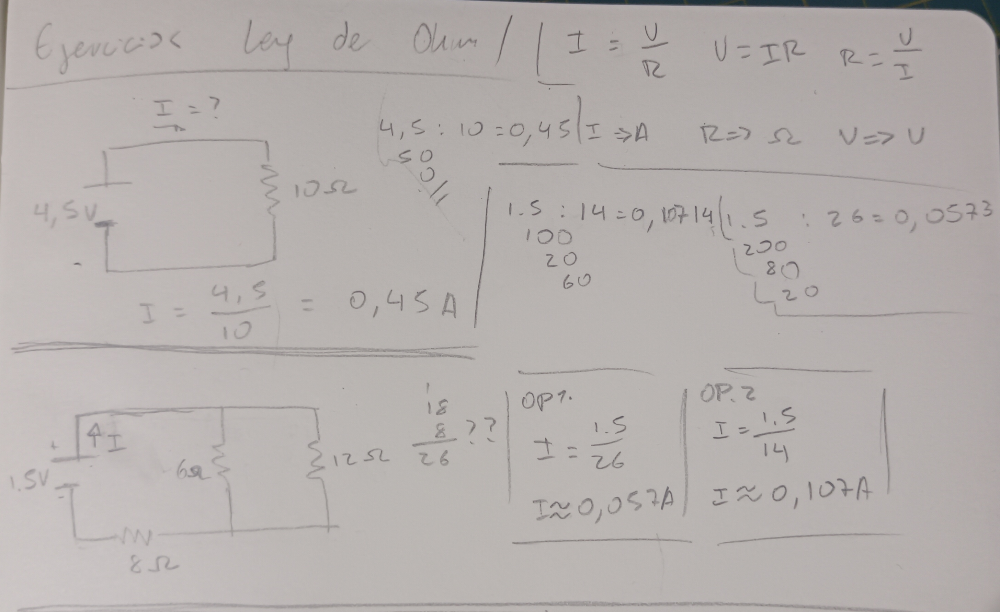
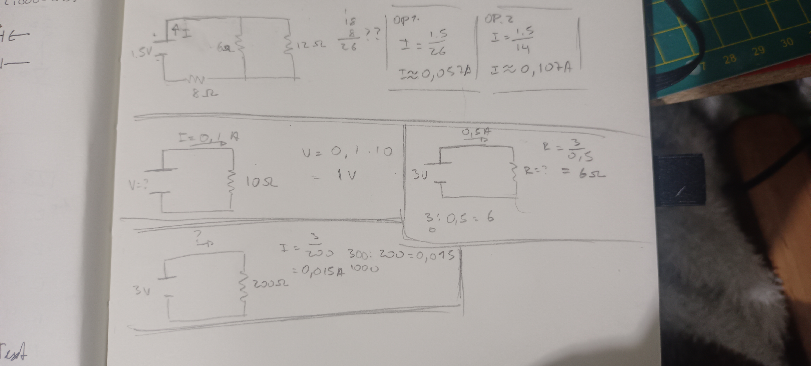

# sesion-02b

# Apuntes clase 20/03

Se nos entregó el chip NE555P, el cual es un circuito integrado (IC) que se utiliza para generar pulsos, temporizadores y oscilaciones. Éste chip tiene 8 patitas, las cuales se pueden enumerar guiándose ya sea por la dirección del texto, por el punto que puede tener el mismo texto, o por el espacio de medio círculo que tiene el chip, el cual siempre va a la izquierda. Luego de identificar el texto o el espacio que tiene el chip, se cuenta empezando desde la patita de abajo en la izquierda, continuando en sentido antihorario como se muestra en la siguiente imagen:

También se nos introdujo a los capacitores (o condensadores), en donde aprendimos que existen los capacitores electrolíticos que son polarizados, y los capacitores cerámicos que no tienen polarización. Para poder identificar el lado negativo de un capacitor electrolítico sin ver las patas uno puede guiarse por el lado gris con líneas que tiene a un costado, el cual indica que ese lado es el negativo.

En el caso del capacitor electrolítico, se nos entregaron tres distintos:

- Capacitor 1μF, 50V
- Capacitor 10μF, 50V
- Capacitor 100μF, 50V

Mientras que en el caso de los capacitores cerámicos, se nos entregó uno que parece una lenteja, el cual tiene el número 104 escrito junto a un punto sobre el texto.

Luego de introducirnos los capacitores y el chip, nos enseñaron cómo utilizar el chip y los capacitores dentro de un circuito, por lo que hicimos el siguiente ejercicio:

| Símbolo | Significado |
| --- | --- |
| R(n) | Resistencia, el (n) es el número para poder identificarla, mientras que al lado de esto se indica de cuánto es la resistencia (1k, 10k en éste caso)|
| C(n) | Capacitor/Condensador, el (n) es el número para poder identificarlo, mientras que al lado de esto se indica de cuánto es el capacitor/condensador (10mF, 100mF en este caso)|
| D | LED |
| +9 | Positivo de la batería 9V |

Como no sabíamos como leer el circuito que nos mostraron, nos fueron guiando mientras armábamos el circuito en nuestra protoboard, en donde aprendí que los puntos que se ven entre los cables significan que se unen/encuentran. Al terminar, la protoboard se veía así:

---

### Capacitor de 10μF

El primer capacitor que conectamos fue el de 10μF, ya que ese es el que se indica en el circuito que se dibujó en la pizarra. Al momento de conectar la batería a la protoboard pensé que iba a ser inmediato el parpadeo del LED, por lo que cuando se tardó un poco en reaccionar pensé que me había equivocado, pero luego de unos pocos segundos se emepzó a comportar como se puede ver en el GIF.

---

### Capacitor de 100μF

Se nos indicó reemplazar el capacitor de 10μF por el de 100μF, y al momento de intercambiarlo volví a pensar que había hecho algo mal porque la luz del LED se mantuvo prendida por más de lo que pensé que iba a durar, pero luego entendí que solo era porque el capacitor aumentó el tiempo en el que dura encendido el LED, al igual que el tiempo de apagado.

---

### Capacitor de 1μF

Luego probamos cambiando el de 100μF al de 1μF, y al momento de conectar el capacitor de 1μF no logré notar ningún cambio en el LED a simple vista, por lo que pensé que sólo se quedaba prendida sin parpadear, pero al momento de grabarlo me di cuenta de que en la cámara del celular si se notaba como la luz se prendía y se apagaba a gran velocidad.

---

### Potenciómetro

Cuando ya probamos con todos los capacitores, se nos indicó reemplazar R2 por un potenciómetro (B100K), el cual se conectó mirando hacia nosotros y se tenía que topar con los cables en la patita de en medio y la última. Con el potenciómetro podíamos manejar con nuestra propia mano la frecuencia en la que parpadeaba la luz del LED, y el resultado fue el siguiente:

### Fotorresistor

Se nos entregaron unos fotorresistores (LDR), los cuales no tienen polaridad. La resistencia que produce este componente depende de la intensidad de la luz a la que se expone, por lo que usamos las linternas de los celulares para poder ver cómo reaccionaba. Aquí se ven los resultados con distintos capacitores:

#### Fotorresistor y capacitor de 1μF

#### Fotorresistor y capacitor de 10μF

#### Fotorresistor y capacitor de 100μF

---

## Encargo

Personalmente, nunca me ha ido bien en las cosas que involucran cálculos (saqué 528 puntos en la PAES M1), mucho menos en física a pesar de que la disfrutaba ya que solo tenía que seguir fórmulas que por alguna razón nunca me salían bien, por lo que quiero trabajar en esto resolviendo ejercicios de la ley de ohm, ya que por lo que entendí la clase pasada tendremos que ver estas formulas y ejercicios durante todo el semestre, por lo que me niego a seguir con el mismo nivel de resolución de ecuaciones. Para esto, buscaré ejercicios en google y los resolveré en mi bitácora física por comodidad. Estos son los resultados:

En el ejercicio que se ve abajo dejé dos opciones en las cuales estoy seguro de que ninguna está bien, o tal vez la segunda opción se puede ver más convincente. Debido a éste ejercicio me di cuenta de que no sé qué se hace en el caso de que haya más de una resistencia, lo cual me ayudó a formular una pregunta para el encargo de las 10 preguntas. Volviendo al ejercicio, no sé cuál de las dos opciones es la menos incorrecta ya que me di cuenta de que la página no traía el resultado.

Mientras hacía estos ejercicios intenté ver videos explicativos de cómo resolver ejercicios de circuitos paralelos, pero cada vez entendía menos y puede ser porque ninguno era como los circuitos que vemos nosotros, y no logré encontrar ningún video explicativo sencillo con esquemas parecidos a los de nosotros. Me dejó un poco decepcionado el no encontrar lo que yo buscaba, aparte de quedar confuso por todos los calculos extraños que tuve que ver antes de darme cuenta de que no era lo que estaba buscando. Igual fue un poco entretenido.

#### 10 Preguntas

- ¿Hay alguna manera de conectar el parlante con el chip NE555P para que haga sonidos de manera intermitente así como parpadeaba el LED?
- ¿Cómo podemos saber qué resistencias usar?, es decir, al momento de crear nuestro propio circuito, ¿hay que sumar la corriente total de todo lo que queremos usar o tenemos que ir calculando componente por componente?
- En Interacciones Inalámbricas mencionó que dejó sugerencias en algunos apuntes de github, ¿eso también lo hace en taller?, de ser así, ¿dónde lo podemos ver?
- 
-
-
-
-
-
-
